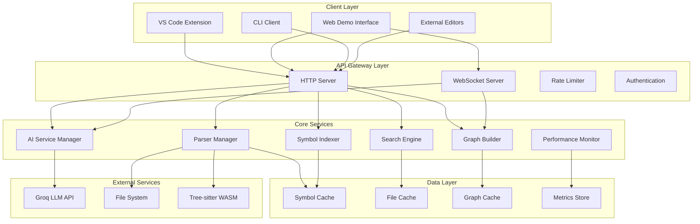
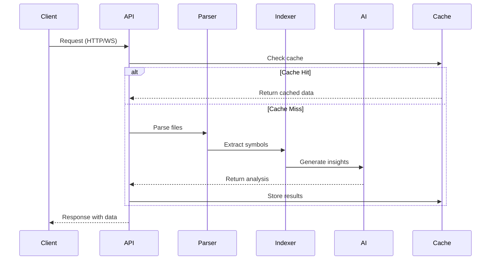

# Design Document

## Overview

This design document outlines the enhancement of the existing Verilog Core API to address the requirements for improved AI integration, performance optimization, enhanced web interface, WebSocket support, graph visualization, and VS Code extension improvements. The design builds upon the current architecture while adding new capabilities and optimizing existing functionality.

The current system consists of:

- HTTP API server with REST endpoints
- Tree-sitter based Verilog/SystemVerilog parser
- Symbol indexer with ctags integration
- Hybrid search engine (symbol + text search)
- VS Code extension with chat functionality
- Basic LLM integration via Groq API

## Architecture

### Enhanced System Architecture



### Component Interaction Flow



## Components and Interfaces

### 1. Enhanced HTTP Server

**Purpose**: Extend the existing HTTP server with new endpoints and improved error handling.

**New Endpoints**:

- `GET /api/v1/graph/modules` - Module hierarchy graph
- `GET /api/v1/graph/signals` - Signal flow graph
- `GET /api/v1/ai/analyze` - AI-powered code analysis
- `GET /api/v1/ai/chat` - Chat interface endpoint
- `GET /api/v1/metrics` - Performance metrics
- `GET /api/v1/status` - Detailed system status

**Interface**:

```typescript
interface EnhancedHttpServer extends HttpServer {
  // WebSocket upgrade handling
  handleWebSocketUpgrade(
    request: http.IncomingMessage,
    socket: net.Socket
  ): void;

  // Performance monitoring
  getMetrics(): SystemMetrics;

  // Rate limiting
  applyRateLimit(req: http.IncomingMessage): boolean;
}

interface SystemMetrics {
  requestCount: number;
  averageResponseTime: number;
  memoryUsage: NodeJS.MemoryUsage;
  cacheHitRate: number;
  activeConnections: number;
}
```

### 2. WebSocket Server

**Purpose**: Provide real-time communication for streaming updates and live collaboration.

**Features**:

- Real-time file change notifications
- Streaming search results
- Live AI chat responses
- Progress updates for long operations

**Interface**:

```typescript
interface WebSocketServer {
  handleConnection(ws: WebSocket, request: http.IncomingMessage): void;
  broadcast(message: WebSocketMessage): void;
  sendToClient(clientId: string, message: WebSocketMessage): void;
}

interface WebSocketMessage {
  type: "file_changed" | "search_result" | "ai_response" | "progress_update";
  data: any;
  timestamp: number;
  clientId?: string;
}
```

### 3. Enhanced AI Service Manager

**Purpose**: Improve the existing LLM integration with better context management and multiple provider support.

**Features**:

- Multiple LLM provider support (Groq, OpenAI, local models)
- Intelligent context building from codebase
- Streaming responses for real-time chat
- Code analysis and explanation capabilities

**Interface**:

```typescript
interface AIServiceManager {
  providers: Map<string, LLMProvider>;
  contextBuilder: ContextBuilder;

  analyzeCode(filePath: string, query?: string): Promise<CodeAnalysis>;
  generateExplanation(symbol: Symbol): Promise<string>;
  answerQuestion(query: string, context: CodeContext): Promise<AIResponse>;
  streamResponse(query: string, context: CodeContext): AsyncIterator<string>;
}

interface CodeAnalysis {
  summary: string;
  complexity: number;
  suggestions: string[];
  dependencies: string[];
  testability: number;
}

interface LLMProvider {
  name: string;
  isAvailable(): boolean;
  generateResponse(prompt: string): Promise<string>;
  streamResponse(prompt: string): AsyncIterator<string>;
}
```

### 4. Graph Builder Service

**Purpose**: Create and manage module hierarchy and signal flow graphs.

**Features**:

- Module instantiation hierarchy
- Signal flow analysis
- Dependency graphs
- Interactive graph data for visualization

**Interface**:

```typescript
interface GraphBuilder {
  buildModuleHierarchy(rootModule?: string): Promise<ModuleGraph>;
  buildSignalFlow(startSignal: string): Promise<SignalGraph>;
  buildDependencyGraph(): Promise<DependencyGraph>;
  updateGraph(filePath: string): Promise<void>;
}

interface ModuleGraph {
  nodes: ModuleNode[];
  edges: ModuleEdge[];
  hierarchy: HierarchyLevel[];
}

interface ModuleNode {
  id: string;
  name: string;
  filePath: string;
  ports: Port[];
  instances: Instance[];
  level: number;
}

interface SignalGraph {
  nodes: SignalNode[];
  edges: SignalEdge[];
  paths: SignalPath[];
}
```

### 5. Performance Monitor

**Purpose**: Track system performance and optimize resource usage.

**Features**:

- Memory usage tracking
- Response time monitoring
- Cache performance metrics
- Resource utilization alerts

**Interface**:

```typescript
interface PerformanceMonitor {
  startMonitoring(): void;
  getMetrics(): PerformanceMetrics;
  trackRequest(endpoint: string, duration: number): void;
  trackMemoryUsage(): void;
  generateReport(): PerformanceReport;
}

interface PerformanceMetrics {
  cpu: CPUMetrics;
  memory: MemoryMetrics;
  requests: RequestMetrics;
  cache: CacheMetrics;
}
```

### 6. Enhanced Caching System

**Purpose**: Implement intelligent caching to improve performance for large codebases.

**Features**:

- Multi-level caching (memory, disk)
- Cache invalidation strategies
- Compressed storage for large datasets
- Cache warming for frequently accessed data

**Interface**:

```typescript
interface CacheManager {
  symbolCache: LRUCache<string, Symbol[]>;
  fileCache: LRUCache<string, string>;
  graphCache: LRUCache<string, Graph>;

  get<T>(key: string, type: CacheType): Promise<T | null>;
  set<T>(key: string, value: T, type: CacheType, ttl?: number): Promise<void>;
  invalidate(pattern: string): Promise<void>;
  warm(keys: string[]): Promise<void>;
}

enum CacheType {
  SYMBOL = "symbol",
  FILE = "file",
  GRAPH = "graph",
  SEARCH = "search",
}
```

## Data Models

### Enhanced Symbol Model

```typescript
interface EnhancedSymbol extends Symbol {
  // Existing fields: id, repo, path, name, kind, startLine, endLine, nodeType, hash

  // New fields
  documentation?: string;
  parameters?: Parameter[];
  connections?: Connection[];
  complexity?: number;
  lastModified: Date;
  dependencies: string[];
  usageCount: number;
}

interface Parameter {
  name: string;
  type: string;
  direction: "input" | "output" | "inout";
  width?: number;
  description?: string;
}

interface Connection {
  targetSymbol: string;
  connectionType: "instantiation" | "assignment" | "reference";
  signalName?: string;
}
```

### Graph Data Models

```typescript
interface Graph {
  id: string;
  type: "module_hierarchy" | "signal_flow" | "dependency";
  nodes: GraphNode[];
  edges: GraphEdge[];
  metadata: GraphMetadata;
  createdAt: Date;
  updatedAt: Date;
}

interface GraphNode {
  id: string;
  label: string;
  type: string;
  properties: Record<string, any>;
  position?: { x: number; y: number };
}

interface GraphEdge {
  id: string;
  source: string;
  target: string;
  label?: string;
  type: string;
  properties: Record<string, any>;
}

interface GraphMetadata {
  rootNode?: string;
  depth: number;
  nodeCount: number;
  edgeCount: number;
  generatedBy: string;
}
```

## Error Handling

### Centralized Error Management

```typescript
interface ErrorHandler {
  handleError(error: Error, context: ErrorContext): ErrorResponse;
  logError(error: Error, context: ErrorContext): void;
  notifyClients(error: Error, affectedClients: string[]): void;
}

interface ErrorContext {
  endpoint: string;
  userId?: string;
  requestId: string;
  timestamp: Date;
  additionalData?: Record<string, any>;
}

interface ErrorResponse {
  success: false;
  error: {
    code: string;
    message: string;
    details?: any;
    suggestions?: string[];
  };
  timestamp: number;
}
```

### Error Categories

1. **Parser Errors**: Syntax errors, unsupported constructs
2. **Index Errors**: File access issues, corruption
3. **Search Errors**: Query parsing, timeout issues
4. **AI Errors**: API failures, rate limiting, context too large
5. **Graph Errors**: Circular dependencies, memory limits
6. **Network Errors**: Connection failures, timeouts
7. **Cache Errors**: Storage failures, corruption

## Testing Strategy

### Unit Testing

- **Parser Manager**: Test with various Verilog constructs
- **Symbol Indexer**: Test symbol extraction accuracy
- **Search Engine**: Test search relevance and performance
- **AI Service**: Test with mock responses and error conditions
- **Graph Builder**: Test graph generation and updates
- **Cache Manager**: Test cache operations and invalidation

### Integration Testing

- **API Endpoints**: Test all HTTP and WebSocket endpoints
- **End-to-End Workflows**: Test complete user scenarios
- **Performance Testing**: Load testing with large codebases
- **Error Scenarios**: Test error handling and recovery

### Test Data

- **Small Test Projects**: Simple modules for unit tests
- **Medium Projects**: CPU designs with multiple modules
- **Large Projects**: Complex SoC designs with thousands of files
- **Edge Cases**: Malformed files, circular dependencies

### Testing Tools

```typescript
interface TestSuite {
  unitTests: UnitTestRunner;
  integrationTests: IntegrationTestRunner;
  performanceTests: PerformanceTestRunner;

  runAll(): Promise<TestResults>;
  runCategory(category: TestCategory): Promise<TestResults>;
  generateReport(): TestReport;
}

interface TestResults {
  passed: number;
  failed: number;
  skipped: number;
  duration: number;
  coverage: number;
  failures: TestFailure[];
}
```

## Performance Optimizations

### Indexing Performance

1. **Incremental Parsing**: Only re-parse changed files
2. **Parallel Processing**: Use worker threads for large repositories
3. **Smart Caching**: Cache parsed ASTs and symbol tables
4. **Lazy Loading**: Load symbols on-demand for large files

### Search Performance

1. **Index Optimization**: Use inverted indexes for fast lookups
2. **Query Optimization**: Optimize search queries based on patterns
3. **Result Caching**: Cache frequent search results
4. **Pagination**: Implement efficient result pagination

### Memory Management

1. **Memory Pools**: Reuse objects to reduce GC pressure
2. **Streaming**: Stream large results instead of loading in memory
3. **Compression**: Compress cached data to reduce memory usage
4. **Cleanup**: Implement periodic cleanup of unused data

### Network Optimization

1. **Response Compression**: Gzip compress API responses
2. **Connection Pooling**: Reuse HTTP connections
3. **Batch Operations**: Batch multiple operations when possible
4. **CDN Integration**: Cache static assets via CDN

## Security Considerations

### Input Validation

- Sanitize all user inputs
- Validate file paths to prevent directory traversal
- Limit query complexity to prevent DoS attacks
- Rate limiting on API endpoints

### Authentication & Authorization

- Optional API key authentication
- Role-based access control for sensitive operations
- Audit logging for security events
- Secure WebSocket connections

### Data Protection

- Encrypt sensitive configuration data
- Secure storage of API keys
- Privacy-aware logging (no sensitive data in logs)
- Secure communication channels

## Deployment Architecture

### Development Environment

```yaml
services:
  verilog-api:
    build: .
    ports:
      - "3000:3000"
    environment:
      - NODE_ENV=development
      - GROQ_API_KEY=${GROQ_API_KEY}
    volumes:
      - ./src:/app/src
      - ./wasm:/app/wasm
```

### Production Environment

```yaml
services:
  verilog-api:
    image: verilog-core:latest
    ports:
      - "3000:3000"
    environment:
      - NODE_ENV=production
      - REDIS_URL=${REDIS_URL}
      - GROQ_API_KEY=${GROQ_API_KEY}
    volumes:
      - cache-volume:/app/cache
    deploy:
      replicas: 2
      resources:
        limits:
          memory: 2G
          cpus: "1.0"
```

### Monitoring & Observability

- Health check endpoints
- Prometheus metrics export
- Structured logging with correlation IDs
- Distributed tracing for complex operations
- Performance dashboards

This design provides a comprehensive enhancement to the existing Verilog Core API while maintaining backward compatibility and focusing on the key requirements of improved AI integration, performance, and user experience.
